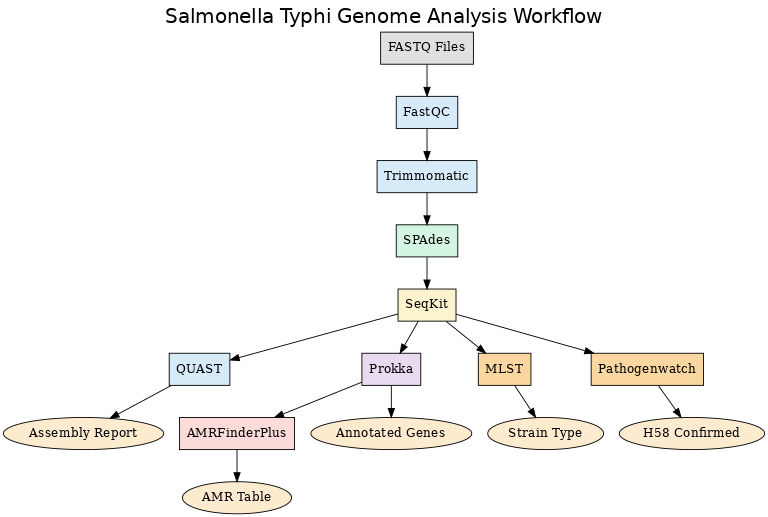

# Salmonella Typhi AMR Profiling Pipeline

This project focuses on the assembly, annotation, and antimicrobial resistance (AMR) profiling of a *Salmonella enterica* isolate using publicly available sequencing data from NCBI.

### 🧬 Workflow

## 🔬 Project Overview 

Designed and implemented the full computational pipeline.
Analyzed AMR genes and proposed a machine learning framework for risk prediction in high-burden lineages (e.g., H58).

- Assembled paired-end sequencing data (`salmonella_R1.fastq`, `salmonella_R2.fastq`) into a high-quality genome.
- Identified the strain as **Serovar Typhi ST1416** using sequence typing.
- Annotated genes using **Prokka**.
- Predicted AMR genes using **AMRFinderPlus**.
- Proposed a future ML-based Risk Score Framework for treatment guidance, leveraging AMR patterns in high-burden strains (e.g., H58).

  Key outputs include:
- HTML reports (FastQC)
- Annotated assemblies (Prokka)
- AMR gene tables (AMRFinderPlus)
- Assembly statistics (QUAST)

## 💡 Prototype Concept

Proposed a future machine learning–based **Risk Score Framework** to predict treatment failure in high-burden *Salmonella* strains (e.g., H58 lineage), based on AMR gene profiles and clinical metadata.

## 📁 Dataset

- Source: [NCBI Sequence Read Archive (SRA)](https://www.ncbi.nlm.nih.gov/sra)
- Organism: *Salmonella enterica*
- Type: Paired-end FASTQ files

> Dataset is not included due to size but can be downloaded using the NCBI accession provided in `data/source_info.txt`.

## 🧪 Tools Used

| Step                | Tool            |
|---------------------|------------------|
| Quality Control     | FastQC, Trimmomatic |
| Genome Assembly     | SPAdes           |
| Contig Filtering    | SeqKit           |
| Assembly Evaluation | QUAST            |
| Sequence Typing     | PubMLST (via `mlst`) |
| Annotation          | Prokka           |
| AMR Profiling       | AMRFinderPlus    |

